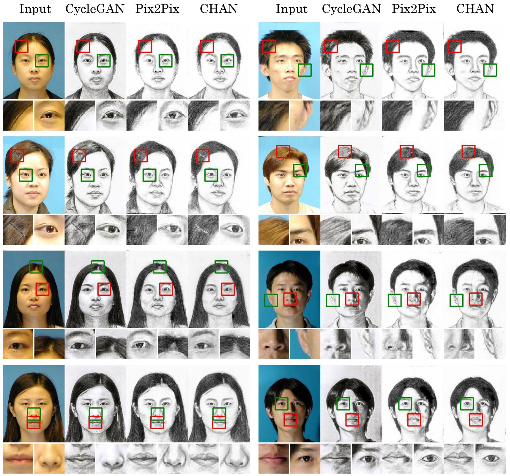

<!-- This paper is about the number 3. The number 4 is left for future work.

[Download paper here](http://academicpages.github.io/files/paper3.pdf)

Recommended citation: Your Name, You. (2015). "Paper Title Number 3." <i>Journal 1</i>. 1(3). -->


## Our Proposed Framework

### Generator


### Discriminator (Multi-layer Integration Discriminator, MID)


## Generated Examples




## Prerequisites

- Linux or similar environment
- Python 2.7
- NVIDIA GPU + CUDA CuDNN

## Getting Started

### installation

- clone this repo:

```shell script
git clone https://github.com/fei-hdu/chan.git
cd chan
```

- install PyTorch 0.4+

### Quick Start

- Download a dataset
  - [CUFS](http://mmlab.ie.cuhk.edu.hk/archive/facesketch.html) splits of training and testing: [files](https://drive.google.com/open?id=1TYQ5O9q4ZMiuBimPMqqj7O_SyHoijwmn)
  - CityScapes, Facades, Google Map, Edge2Shoes, Edge2Handbags: [Pix2Pix bash](https://github.com/phillipi/pix2pix/blob/master/datasets/download_dataset.sh)

<!--

- We use fine-tuning to train our model. For example, on the CUFS
    - first you need train on Pix2Pix to get a coarse model or you can Download a pre-trained model(pre-trained with [Pix2Pix](https://github.com/jehovahxu/pix2pix-pytorch)) in  [here](https://drive.google.com/open?id=1dfe2pqAUD4T6fD9vO38SM2HCYJSe9Nxj)

-->

- Train:

  ```shell script
  python train.py --dataroot {dataset path} --datalist {datalist path} --pre_netG {coarse model path} --gpuid {your gpu ids}
  ```

- Test:
  ```shell script
  python test.py --dataroot {dataset path} --datalist {datalist path} --pre_netG {final model path} --gpuid {your gpu ids}
  ```

### Apply our pre-trained model

A _face photo-to-sketch_ model pre-trained on the CUSF dataset: [Google Drive](https://drive.google.com/open?id=173H7FdwG7UOMM1G-4sm7zKUBu0yFypul)

The pre-trained model need to be save at `./checkpoint`

Then you can test this imodel.

## Results

Our final results can be downloaded [here](https://drive.google.com/open?id=1AzmHkcGa21h6Mngdc7sEIH1hOR6GrBTS)

​Our Quantitative performance in a variety of image-to-image translation tasks are shown below. We assign a _score_ of +1, 0, or -1 to the best, mediate, and worst model according to each performance index. For each method, the total score on each dataset and that across all these datasets, are reported.


## Training/Test Tips

Best practice for training and testing your models.
Feel free to ask any questions about coding. **Xingxin Xu**, [jehovahxu@gmail.com](jehovahxu@gmail.com)

## Citation

If you find this useful for your research, please cite our paper as:

> Fei Gao, Xingxin Xu, Jun Yu, Meimei Shang, Xiang Li, and Dacheng Tao, Complementary, Heterogeneous and Adversarial Networks for Image-to-Image Translation, _IEEE Transactions on Image Processing_, 2021. (Accepted)

```latex
@article{gao2021chan,
	title = {Complementary, Heterogeneous and Adversarial Networks for Image-to-Image Translation},
	author = {Fei Gao and Xingxin Xu and Jun Yu and Meimei Shang and Xiang Li and Dacheng Tao},
	journal = {IEEE Transactions on Image Processing},
	year = {2021},
	url = {https://github.com/fei-hdu/chan},
}
```

## Acknowledgments

Our code is inspired by [pytorch-CycleGAN-and-pix2pix](https://github.com/junyanz/pytorch-CycleGAN-and-pix2pix)
